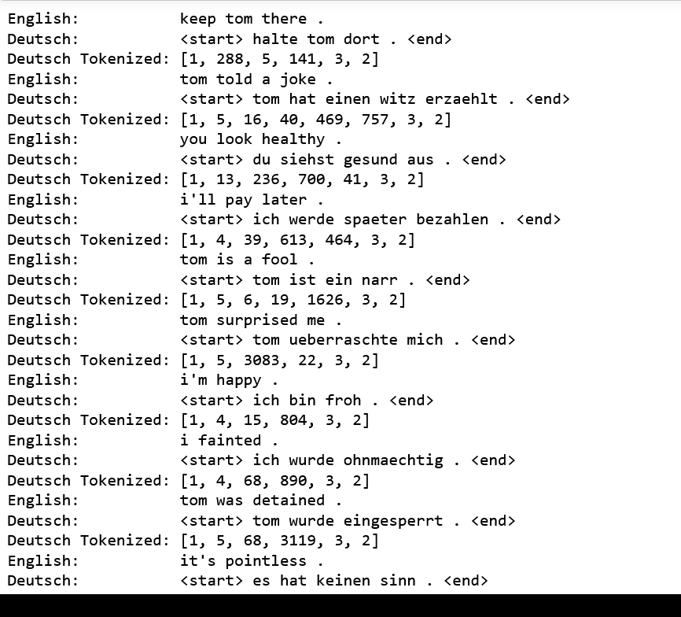
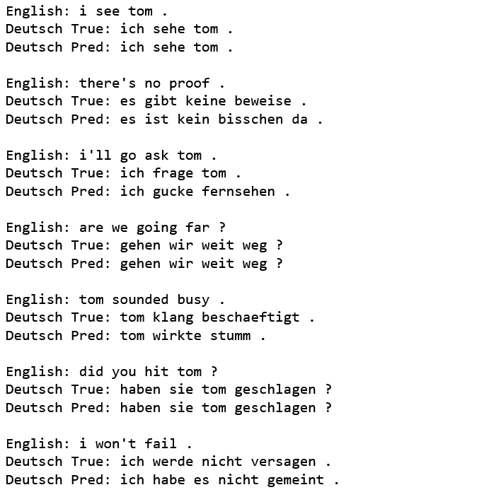

# Neural Machine Translation
## Deutsch to English

* citing the point that a word based model is far more efficient than a character based model for translation based applications.
* Maybe text generation applications can be better for character based models

### Dataset: [ANKI](http://www.manythings.org/anki/)

### LSTM Encoder-Decoder Schematic:

### Input Examples:

### Output Examples:

