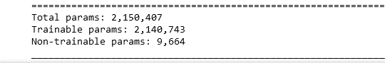
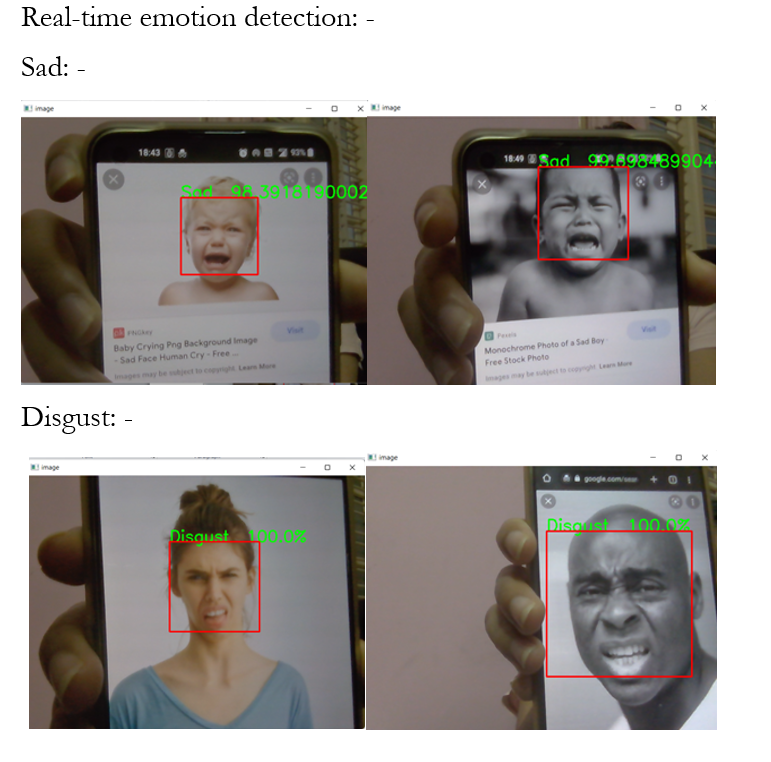
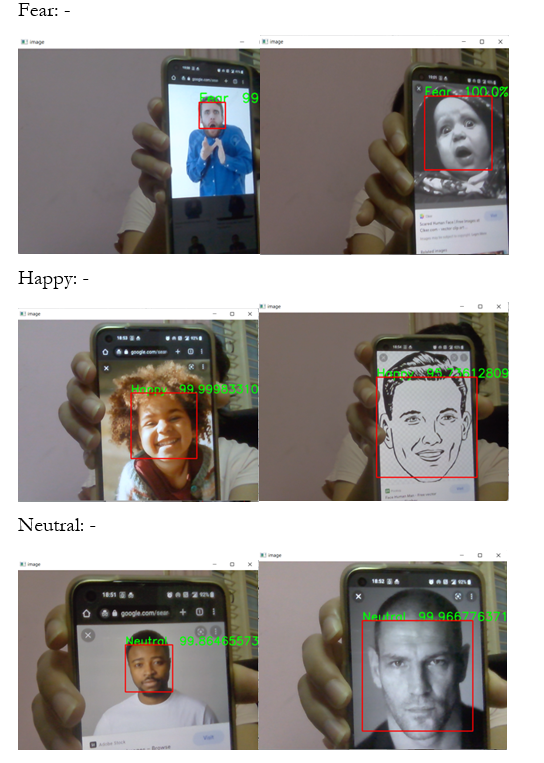
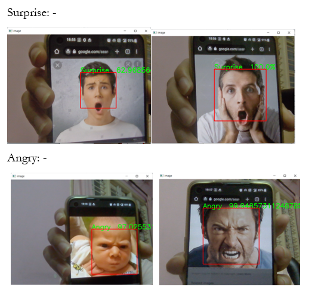

# Documentation, EMOTOR 2022

## Data

The Fer-2013 Dataset ```(48x48x3)``` appears greyscale due to its lack of color channel contrast.
Consequently, a vanilla __CNN__ model is more suited than an **Xception**-esque model.


## Distribution

Far from balanced nor clean, the inherent nature of the data was mostly 
the reason for the majority of underperforming models.


## Model


With nearly 2.1 M parameters, the model resembes **Xception**.
The depth, paired with residual & separable_conv_2d layers are more suited for a more fuller dataset, but nonetheless, shows reluctance to overfit compared to a vanilla CNN and was chosen.

Model architecture is shown in the .ipynb file.

## Metrics
The best model was retrieved using __Model Checkpoint__ callback.


## Evaluation and Scores
On training data:


## Real-time predictions








### References
[Xception: Deep Learning with Depthwise Separable Convolutions](https://arxiv.org/abs/1610.02357 "arxiv")
