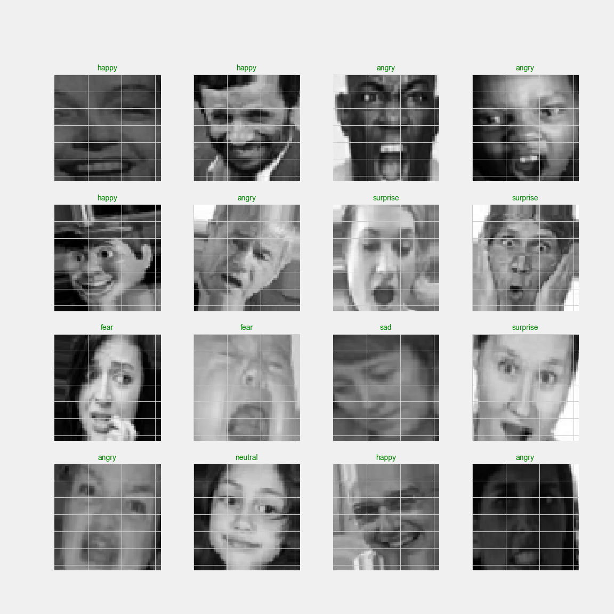
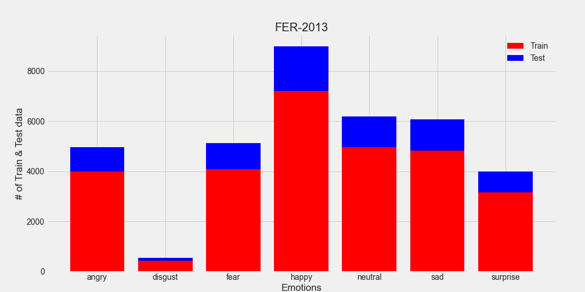
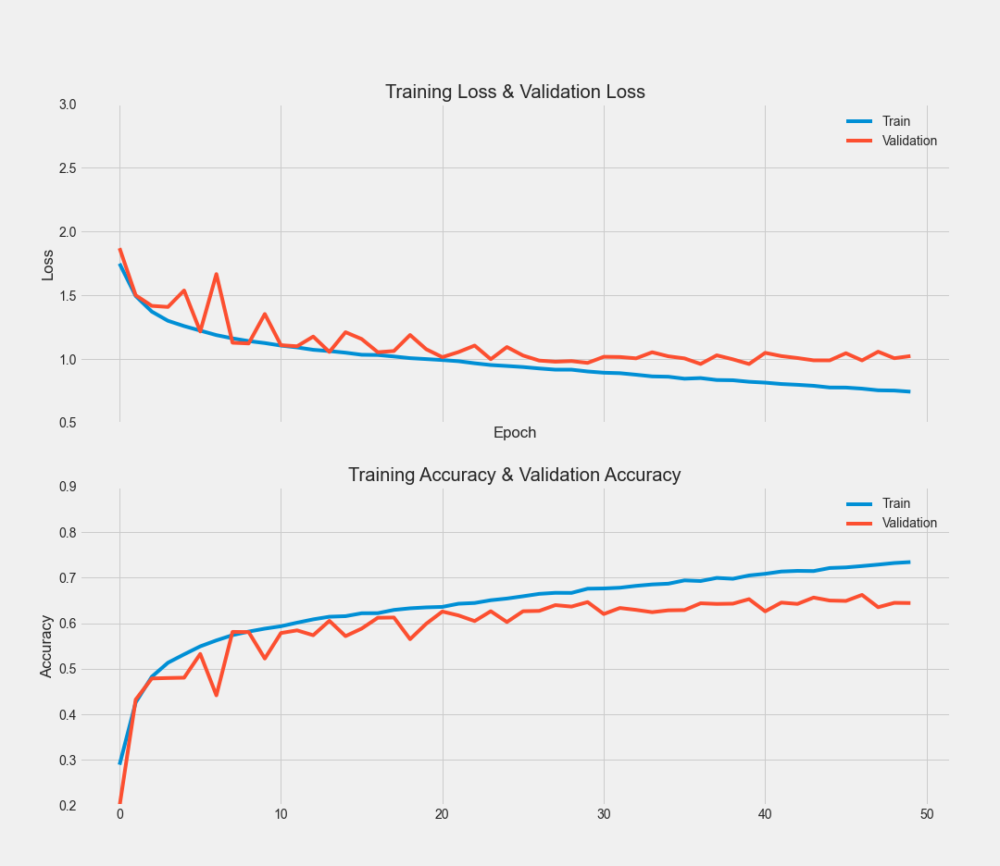
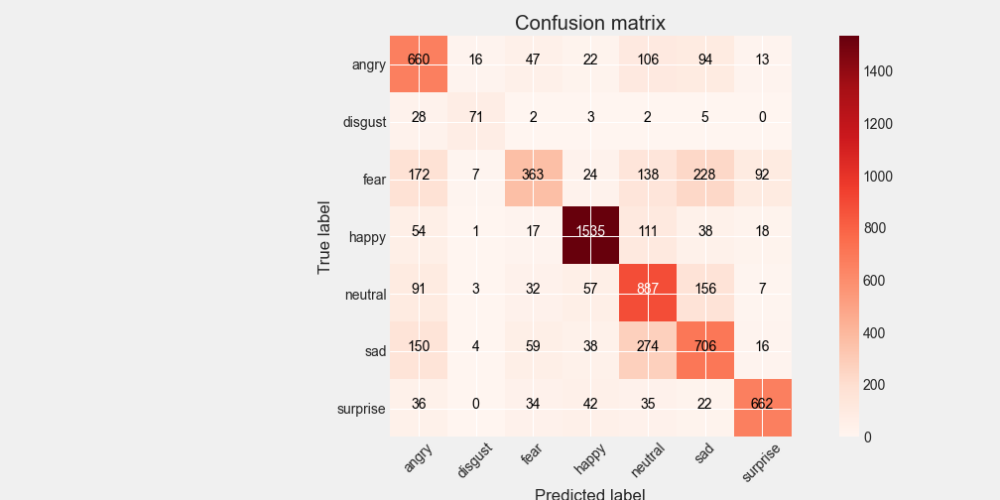
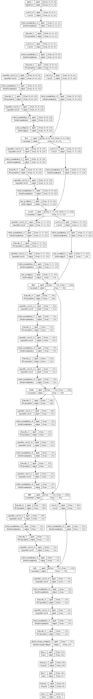

# Documentation, EMOTOR 2022

## Data

The Fer-2013 Dataset ```(48x48x3)``` appears greyscale due to its lack of color channel contrast.
Consequently, a vanilla __CNN__ model is more suited than an **Xception**-esque model.


## Distribution

Far from balanced nor clean, the inherent nature of the data was mostly 
the reason for the majority of underperforming models.



## Model

With nearly 2.1 M parameters, the model resembes **Xception**
The depth and residual, separable layers are more suited for a different dataset, but nonetheless, shows great reluctance to overfit, compared to a vanilla CNN.


Image is shown below.

## Metrics
The best model was retrieved using __Model Checkpoint__ callback.




## Evaluation and Scores
On training data:




## Model



### References
[Xception: Deep Learning with Depthwise Separable Convolutions](https://arxiv.org/abs/1610.02357 "arxiv")
